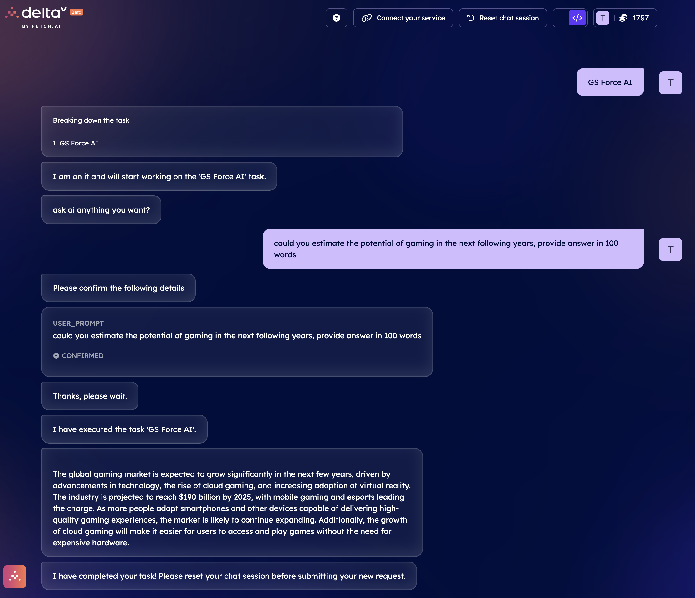
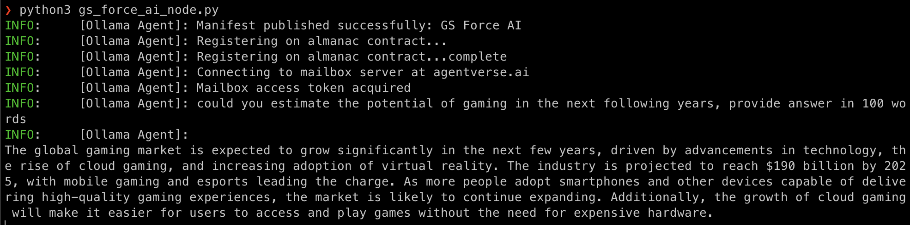
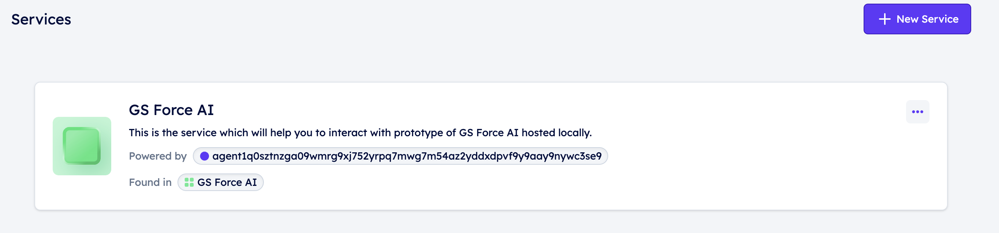

# GS Node AI with Fetch.ai (PoC)

The aim of this project is to build simple PoC of the agent which is using fetch.ai infrastructure, this agent is locally hosted by GameSwift community member beside the GameSwift Launcher.

Please keep in mind that this agent is **hosted locally**, so is available only when host is online and agent is running.

## How to run

1. Clone the repository
2. `cd fetchai_agent_for_ollama`
3. `poetry shell`
4. Make sure you have `ollama` working on your machine, this PoC is using `llama2` model, you can check if it is running with `ollama ps` command
5. `python3 gs_force_ai_node.py`

## Used technology stack

- [uagents](https://pypi.org/project/uagents/) from [Fetch.ai](https://fetch.ai/docs/concepts/agents/agents),
- [Agentverse](https://agentverse.ai/),
- [DeltaV](https://deltav.agentverse.ai/chat?objective=GS%20Force%20AI&serviceGroup=34afd1b8-387d-45e2-833c-7f76a08209d6&personality=talkative-01)
- [Ollama](https://ollama.com/)

Provided here PoC is using `llama2` model from [Meta](https://llama.meta.com/llama-downloads/).

> Llama 2 is released by Meta Platforms, Inc. This model is trained on 2 trillion tokens, and by default supports a context length of 4096. Llama 2 Chat models are fine-tuned on over 1 million human annotations, and are made for chat.

### Models which also could be used here:

At the time of writing there is above [70 models](https://ollama.com/library), which could be accessed this way.

## Screenshots

### DeltaV interface

### Command line on local machine

### Regsitered service on Agentverse

